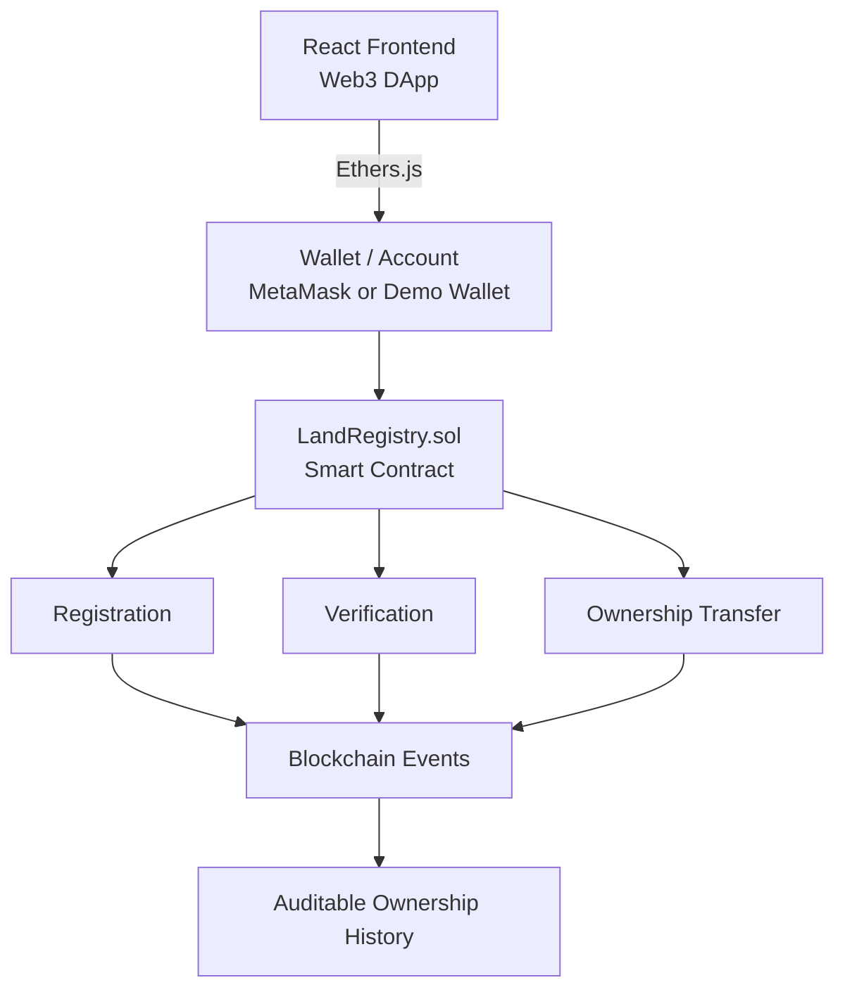
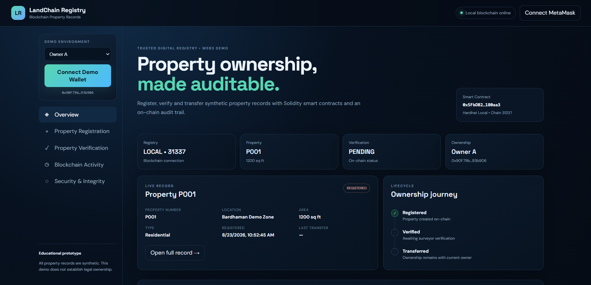
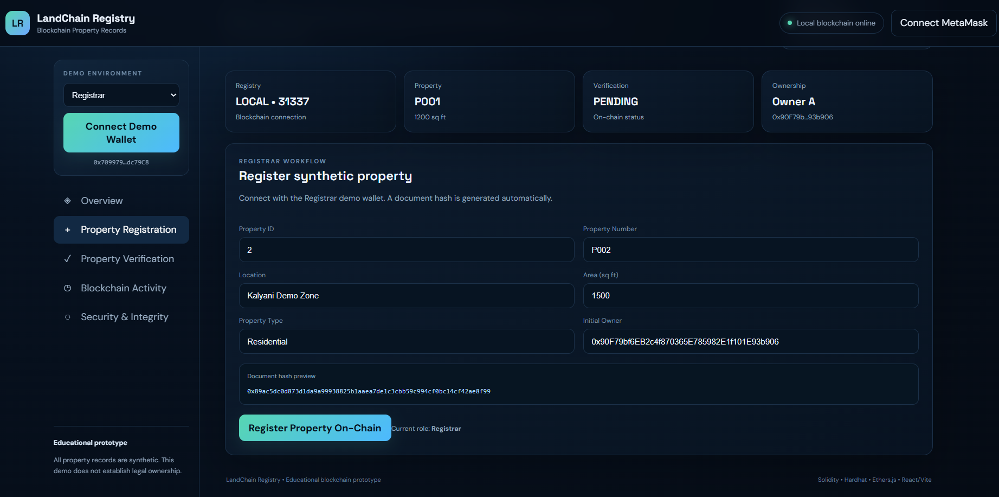
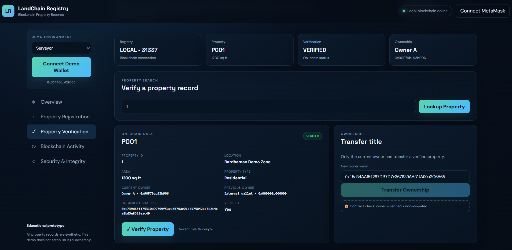
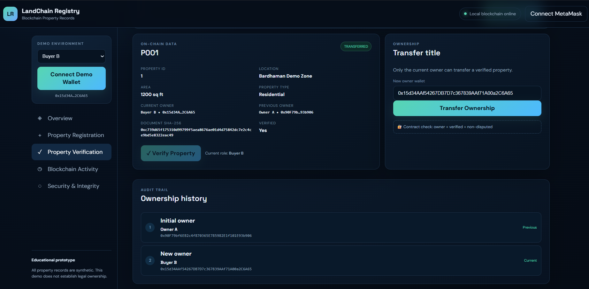
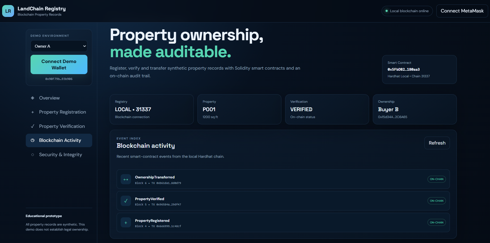
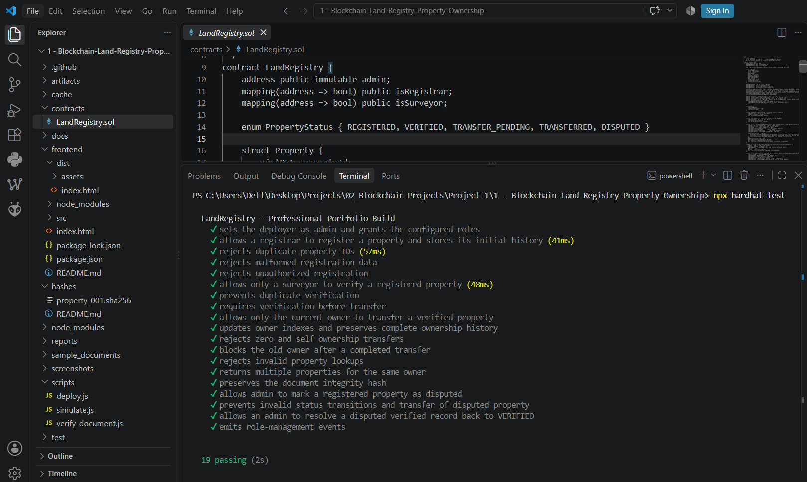

# Blockchain-Based Land Registry & Property Ownership System


An educational blockchain-based land registry prototype built with Solidity, Hardhat, Ethers.js, React, and Vite. It demonstrates role-based property registration, independent verification, ownership transfer, document-hash verification, and an auditable on-chain ownership history using synthetic property data.

> **Educational Disclaimer:** This project uses only dummy/synthetic property records and local test wallets. It does not establish or represent legally valid property ownership. See [Legal & Real-World Considerations](#legal--real-world-considerations).

---

## Table of Contents

- [Overview](#overview)
- [Problem Statement](#problem-statement)
- [Objectives](#objectives)
- [Industry Relevance](#industry-relevance)
- [Educational Disclaimer](#educational-disclaimer)
- [Blockchain Concepts Used](#blockchain-concepts-used)
- [Actors](#actors)
- [Technology Stack](#technology-stack)
- [System Architecture](#system-architecture)
- [Property Data Model](#property-data-model)
- [Property Registration](#property-registration)
- [Property Verification](#property-verification)
- [Ownership Transfer](#ownership-transfer)
- [Ownership History](#ownership-history)
- [Document Hash Verification](#document-hash-verification)
- [Smart Contract Functions](#smart-contract-functions)
- [Events](#events)
- [Security Controls](#security-controls)
- [Folder Structure](#folder-structure)
- [Installation](#installation)
- [Remix Simulation](#remix-simulation)
- [Hardhat Testing](#hardhat-testing)
- [Optional Frontend](#optional-frontend)
- [Screenshots](#screenshots)
- [Results](#results)
- [Limitations](#limitations)
- [Legal & Real-World Considerations](#legal--real-world-considerations)
- [Future Improvements](#future-improvements)
- [Learning Outcomes](#learning-outcomes)
- [Author](#author)
- [License](#license)

---

## Overview

Traditional property records are often fragmented across multiple offices and databases, making verification, reconciliation, and ownership-history tracking difficult. This project demonstrates how a Solidity smart contract can create a tamper-evident digital registry where property records are registered on-chain, authorized roles control key operations, ownership is tied to wallet addresses, transfers are validated by contract rules, document integrity is verified via cryptographic hashing, and every state change is preserved as a permanent, auditable blockchain event.

The prototype runs against a local Hardhat blockchain and is paired with an interactive React/Vite frontend that walks through the full registration → verification → transfer → audit workflow.

## Problem Statement

Traditional land-record systems commonly face fragmented records across offices, manual and slow verification, duplicate or conflicting entries, difficult ownership-history reconstruction, undetectable document manipulation, and limited transparency into who changed what and when.

A blockchain-based registry demonstrates a tamper-evident mechanism for recording property transactions and ownership history — but it does not, by itself, make the underlying information legally correct. That distinction is central to this project and is revisited throughout.

## Objectives

1. Register property records using a Solidity smart contract.
2. Implement role-based access control (Admin, Registrar, Surveyor).
3. Verify property records through an authorized role, separate from registration.
4. Associate property ownership with wallet addresses.
5. Allow only verified properties to be transferred, and only by the current owner.
6. Prevent unauthorized registration, verification, and transfer attempts.
7. Generate and verify SHA-256 document hashes.
8. Preserve every significant state change as a blockchain event.
9. Provide a React-based Web3 interface for the full workflow.
10. Test the smart contract with an automated Hardhat suite covering both valid and adversarial cases.
11. Demonstrate the complete workflow end-to-end using synthetic data.

## Industry Relevance

The concepts demonstrated here are applicable to government land registries, real-estate technology (proptech), property management platforms, title verification, property due-diligence, mortgage/loan verification, housing societies, and digital document authentication.

Potential benefits of this pattern include tamper-evident records, improved auditability, easier ownership tracking, faster verification, reduced duplicate records, and transparent transaction history. This should be read as a **prototype demonstrating applicable concepts**, not a production-ready land-registry solution.

## Educational Disclaimer

This is an educational blockchain prototype. All property information used is synthetic, and the records created here do **not** establish legal property ownership.

A real-world implementation would require integration with government land authorities, legal identity verification systems, cadastral/survey databases, courts and dispute-resolution mechanisms, official property-registration authorities, and applicable property law. Blockchain can preserve a tamper-evident record of information entered into the system — it cannot independently guarantee that information was legally correct to begin with.

## Blockchain Concepts Used

| Concept | Usage in this project |
|---|---|
| Blockchain | Immutable transaction and event record |
| Ethereum / Solidity | Smart-contract platform and language |
| Hardhat | Local blockchain development and testing environment |
| Ethers.js | Frontend-to-contract interaction |
| Wallet Address | Represents an actor/owner |
| `msg.sender` | Identifies the transaction caller for access control |
| `struct` | Defines the `Property` record shape |
| `mapping` | Property lookup, ownership index, ownership history |
| `enum` | Property status (`REGISTERED`, `VERIFIED`, `TRANSFER_PENDING`, `TRANSFERRED`, `DISPUTED`) |
| `modifier` | Reusable access-control checks (`onlyAdmin`, `onlyRegistrar`, `onlySurveyor`, `onlyPropertyOwner`, `validProperty`) |
| Events | Auditable trail of every significant state change |
| `require()` | Validates conditions and reverts invalid transactions |
| Document Hash | On-chain SHA-256 fingerprint of an off-chain document |
| Transaction Hash | Unique identifier for every on-chain change |
| dApp | Blockchain-connected React frontend |

## Actors

| Actor | Responsibility |
|---|---|
| **Admin** | Manages Registrar/Surveyor roles; can update property status |
| **Registrar** | Registers new property records |
| **Surveyor** | Verifies registered properties |
| **Property Owner** | Transfers a verified property they currently hold |
| **Buyer / New Owner** | Receives ownership after a valid transfer |
| **Unauthorized User** | Used to demonstrate and test rejected/negative cases |

## Technology Stack

**Blockchain:** Solidity, Hardhat, Ethereum-compatible local blockchain (Chain ID 31337)
**Contract Interaction:** Ethers.js, JavaScript
**Frontend:** React, Vite, HTML, CSS
**Wallet:** MetaMask (optional) + built-in demo wallets
**Testing:** Hardhat, Mocha/Chai
**Document Integrity:** SHA-256

## System Architecture



**Workflow:** Registration → ownership assigned → verification → verified property → owner-initiated transfer → contract validates ownership + verification + status → new owner assigned → `OwnershipTransferred` emitted → history preserved via events and the on-chain `ownershipHistory` array.

## Property Data Model

The `Property` struct stores:

| Field | Description |
|---|---|
| `propertyId` | Unique numeric identifier |
| `propertyNumber` | Human-readable reference (e.g. `P001`) |
| `location` | Text description of the property's location |
| `area` | Property area (must be positive) |
| `propertyType` | Category, e.g. Residential |
| `currentOwner` | Wallet address of the present owner |
| `previousOwner` | Wallet address of the prior owner |
| `documentHash` | SHA-256 hash of the off-chain supporting document |
| `verified` | Whether a Surveyor has verified this record |
| `status` | `REGISTERED`, `VERIFIED`, `TRANSFER_PENDING`, `TRANSFERRED`, or `DISPUTED` |
| `registeredAt` | Registration timestamp |
| `lastTransferredAt` | Timestamp of the most recent transfer |

Example: `P001`, Bardhaman Demo Zone, 1200 sq ft, Residential, Owner A, status `VERIFIED`. All records are synthetic.

## Property Registration

`registerProperty()` — **Registrar only.** Validates property ID uniqueness, non-zero owner address, valid property metadata, and a supplied document hash. On success, emits `PropertyRegistered` and sets status to `REGISTERED`.

## Property Verification

`verifyProperty()` — **Surveyor only.** Validates the property exists and rejects duplicate verification of an already-verified record. Verification is deliberately a separate role and step from registration, so that creating a record and validating it are two independent checks rather than one combined action. On success, emits `PropertyVerified` and sets `verified = true`.

## Ownership Transfer

`transferOwnership()` — restricted to the **current owner** via the `onlyPropertyOwner` modifier. Requires the property to be verified, the new owner to be non-zero and not the current owner, and the property to not already have a transfer pending. Updates `currentOwner`/`previousOwner`, stamps `lastTransferredAt`, appends to the on-chain ownership-history array, and emits `OwnershipTransferred`.

## Ownership History

Ownership history is preserved two ways: as an **on-chain array** per property (`getOwnershipHistory(propertyId)`, returning every historical owner address in order) and as the **emitted event log** (`PropertyRegistered`, `PropertyVerified`, `OwnershipTransferred`), which the frontend's Blockchain Activity panel reads directly from the local chain.

```text
Initial Owner → Owner A → (transfer) → Buyer B
```

## Document Hash Verification

Property documents are not stored on-chain — only their SHA-256 hash is.

```text
property_001.json → SHA-256 → Document Hash → stored on-chain
```

If the document is later modified, hashing the modified copy produces a **different** hash than the one stored at registration — the mismatch demonstrates tamper detection without needing to store the document itself on-chain.

```bash
npm run verify:document
```

Sample files: `sample_documents/property_001.json`, `sample_documents/property_001_modified.json`, `hashes/property_001.sha256`.

## Smart Contract Functions

| Function | Access | Purpose |
|---|---|---|
| `setRegistrar(address, bool)` | Admin | Grants/revokes the Registrar role |
| `setSurveyor(address, bool)` | Admin | Grants/revokes the Surveyor role |
| `registerProperty(...)` | Registrar | Registers a new property |
| `verifyProperty(propertyId)` | Surveyor | Marks a property verified |
| `transferOwnership(propertyId, newOwner)` | Current owner | Transfers a verified property |
| `updatePropertyStatus(propertyId, status)` | Admin | Updates status (e.g. to `DISPUTED`) |
| `getProperty(propertyId)` | Public | Reads a property's full record |
| `getPropertiesByOwner(address)` | Public | Lists property IDs held by an address |
| `getOwnershipHistory(propertyId)` | Public | Returns the full historical owner list |
| `getPropertyCountForOwner(address)` | Public | Number of properties held by an address |

## Events

| Event | Emitted when |
|---|---|
| `PropertyRegistered` | A property is successfully registered |
| `PropertyVerified` | A Surveyor verifies a property |
| `OwnershipTransferred` | Ownership successfully changes hands |
| `PropertyStatusUpdated` | Admin changes a property's status |
| `RegistrarUpdated` | Admin grants/revokes the Registrar role |
| `SurveyorUpdated` | Admin grants/revokes the Surveyor role |

## Security Controls

- Role-based modifiers (`onlyAdmin`, `onlyRegistrar`, `onlySurveyor`, `onlyPropertyOwner`)
- Property-existence validation before reads/writes (`validProperty`)
- Unique property ID enforcement — duplicate registration rejected
- Non-zero address validation for owners and transfer recipients
- Verification required before a property can be transferred
- Current-owner validation via `msg.sender`, not a client-supplied parameter
- Rejects transfer to the same address (self-transfer) and to an address with a pending transfer already in progress
- Disputed-property status blocks invalid transitions
- Duplicate-verification rejection
- Events emitted for every significant state change, forming the audit trail

## Folder Structure

```text
Blockchain-Projects/
└── 01-Blockchain-Land-Registry-Property-Ownership/
    ├── contracts/
    │   └── LandRegistry.sol
    ├── scripts/
    │   ├── deploy.js
    │   ├── simulate.js
    │   └── verify-document.js
    ├── test/
    │   └── LandRegistry.test.js
    ├── frontend/
    │   ├── src/
    │   │   ├── main.jsx
    │   │   ├── style.css
    │   │   ├── abi.js
    │   │   ├── config.js
    │   │   └── deployment.json
    │   ├── index.html
    │   ├── package.json
    │   └── package-lock.json
    ├── sample_documents/
    │   ├── property_001.json
    │   └── property_001_modified.json
    ├── hashes/
    │   ├── README.md
    │   └── property_001.sha256
    ├── Output/
    │   ├── 01_overview.png
    │   ├── 02_property_registration.png
    │   ├── 03_property_verification.png
    │   ├── 04_ownership_transfer.png
    │   ├── 05_blockchain_activity.png
    │   └── 06_hardhat_tests_19_passing.png
    ├── reports/
    │   └── project-report.md
    ├── docs/
    │   ├── demo-runbook.md
    │   ├── implementation-plan.md
    │   ├── linkedin-post.md
    │   └── screenshot-checklist.md
    ├── .github/
    │   └── workflows/
    │       └── ci.yml
    ├── .gitignore
    ├── LICENSE
    ├── README.md
    ├── START-HERE.md
    ├── hardhat.config.js
    ├── package.json
    ├── package-lock.json
    ├── start-demo.ps1
```

## Installation

Requires [Node.js 18+](https://nodejs.org).

```bash
git clone https://github.com/Subhamrbj/Blockchain-Projects.git
cd Blockchain-Projects/01-Blockchain-Land-Registry-Property-Ownership

npm install
npx hardhat compile
npx hardhat test
```

## Remix Simulation

`LandRegistry.sol` can also be tested directly in [Remix IDE](https://remix.ethereum.org) against the Remix VM, with no local install required:

1. Create and compile `LandRegistry.sol` in Remix.
2. Deploy using the Remix VM.
3. Using Account 0 (Admin), call `setRegistrar()` and `setSurveyor()` to grant roles to Account 1 and Account 2.
4. Using Account 1 (Registrar), register `P001` with Account 3 (Owner A) as the initial owner.
5. Using Account 4 (unauthorized), attempt to verify — confirm it reverts.
6. Using Account 2 (Surveyor), verify the property.
7. Using Account 3 (Owner A), transfer to Account 4 (Buyer B); confirm the new owner via `getProperty()`.
8. Using Account 3 again, attempt a second transfer of the same property — confirm it reverts.
9. Call `getOwnershipHistory()` and review the emitted events to confirm the full ownership trail.

## Hardhat Testing

**19/19 tests passing.**

```bash
npx hardhat test
```

The suite covers: correct role assignment at deployment, successful registration by an authorized Registrar, duplicate property ID rejection, malformed registration data rejection, unauthorized registration rejection, verification restricted to the Surveyor role, duplicate-verification prevention, verification required before transfer, transfer restricted to the current owner, owner-index and full ownership-history consistency after transfer, zero-address and self-transfer rejection, the old owner being blocked from further transfers after completing one, invalid property-lookup handling, multi-property ownership lookups, document-hash preservation through the full lifecycle, admin-driven status updates (including disputing a property), invalid status-transition and disputed-transfer rejection, admin resolving a disputed record back to `VERIFIED`, and correct emission of role-management events.

## Optional Frontend

The frontend provides a Web3 interface for the full workflow: Overview dashboard, Property Registration, Property Verification (with the transfer panel and its contract-side checks surfaced in the UI), Ownership History timeline, Blockchain Activity feed, and a Security & Integrity / document-hash verifier panel. It supports simulated demo roles (Owner A, Registrar, Surveyor, Buyer B) via built-in local accounts, plus optional MetaMask connection — no external wallet setup is required to try the full demo.

```bash
cd frontend
npm install
npm run dev
```

## Screenshots

### 1. Application Overview


### 2. Property Registration


### 3. Property Verification


### 4. Ownership Transfer


### 5. Blockchain Activity


### 6. Hardhat Test Suite — 19/19 Passing


## Results

The completed prototype demonstrates successful property registration, a working verification workflow, verified ownership transfer, on-chain ownership history (both array-based and event-based), document hash verification and tamper detection, role-based operation enforcement, blockchain event logging, a passing Hardhat automated test suite (19/19), a functioning React Web3 frontend, and full execution on a local blockchain end-to-end.

## Limitations

This project is an educational prototype and does not represent a production government land registry.

- **Legal identity** — a wallet address does not represent a legally verified identity.
- **Garbage in, garbage out** — blockchain preserves entered information; it cannot guarantee that information was truthful when entered.
- **Government integration** — a real implementation would require integration with official land records and government authorities.
- **Property disputes** — real systems must support court orders, disputes, inheritance, liens, and mortgages, none of which are modeled here beyond a binary `DISPUTED` flag.
- **Privacy** — sensitive personal information should never be stored directly on a public blockchain.
- **Key security** — loss or compromise of a private key can create serious ownership-security risks.

## Legal & Real-World Considerations

Blockchain provides tamper-evident record-keeping; it does not independently establish legal property ownership. A production implementation would require government authority backing, verified legal identity infrastructure, cadastral/survey database integration, formal legal approval, registrar integration, court/dispute mechanisms, mortgage and lien handling, inheritance workflows, data-privacy controls, and secure key-management practices — none of which are in scope for this educational prototype.

## Future Improvements

- Multi-party transfer approval (the reserved `TRANSFER_PENDING` status is a natural hook for this)
- Digital signatures for off-chain document authenticity
- IPFS-based document storage with on-chain content references
- Decentralized identity (DID) integration
- GIS/cadastral database integration
- Mortgage and lien management
- Property dispute-resolution workflow, including court-order integration
- Payment/escrow simulation
- Public testnet deployment
- Off-chain event indexing for faster history queries at scale
- Production-grade security audit

## Learning Outcomes

This project provided hands-on experience with Solidity smart-contract design (structs, mappings, enums, modifiers), role-based access control, Hardhat development and testing (including adversarial/negative test cases), Ethers.js contract interaction, React Web3 frontend development, event-driven audit-trail design, cryptographic document-integrity verification, local blockchain simulation, MetaMask integration, and Git/GitHub project management for a portfolio-ready repository.

## Author

**Subham Bhattacherjee**
M.Tech Computer Science & Engineering, University of Kalyani

**Project:** Blockchain-Based Land Registry & Property Ownership System
**GitHub:** https://github.com/Subhamrbj/Blockchain-Projects/tree/main/01-Blockchain-Land-Registry-Property-Ownership

## License

Released under the [MIT License](LICENSE).
